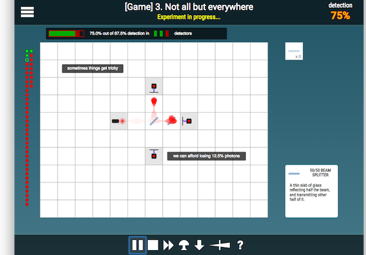

Quantum Game with Photons
============

Quantum Game - play with photons, superposition and entanglement. In your browser! With true quantum mechanics underneath!

* **[I look for collaborators** - a paid 2-3 months internship in CQT Singapore](https://github.com/stared/quantum-game/issues/17)
* Official address: http://quantumgame.io (initial beta released on 3 Jun 2016, http://play.quantumgame.io)
* Social media: Facebook: [Quantum Game with Photons](https://www.facebook.com/quantumgameio), Twitter: [@quantumgameio](https://twitter.com/quantumgameio)
* Authors: [Piotr Migdał](http://p.migdal.pl), [Patryk Hes](https://github.com/pathes), [Michał Krupiński](http://www.fiztaszki.pl/user/3).
* Supported by: [eNgage III/2014](http://www.fnp.org.pl/laureaci-engage-iii-edycja/) grant.
* A recent screenshot:




# Development version

**Open for collaboration!** [For more details, see here.](https://github.com/stared/quantum-game/issues/17)

It's JavaScript, ES6. To build it you need [Node.JS](https://nodejs.org/) and [jspm.io](http://jspm.io/) package manager.

It's open for collaboration - from level creation, through interface (re)design and adding additional effects (two-photon interference, interactions with an electron). Interested? Mail pmigdal@gmail.com.


## Installing

After installing Node.js and jspm.io, and cloning this repository:

First, install global packages:
```bash
npm install --global karma-cli
```

Then install local packages.
```bash
npm install
jspm install
```

Additionally, for development we use `eslint` with `eslint-plugin-lodash`.

## Running server

Start local HTTP server in the quantum game directory (e.g. by [http-server](https://www.npmjs.com/package/http-server)).

## Running tests

```bash
karma start
```

# Production version

Bundle it (and minify, if you want):

```bash
jspm bundle-sfx --minify app
```

It creates a `build.js` file. To run it we need a modified `index.html` (it is a *manually*-modified file, stored in `bundled/index.html`).

On the server, the structure of files should look as follows:

```bash
css\
favicon.ico
build.js
index.html
```

## Docker

Alternatively, you can install dependencies using Docker.

### Building

* You can build this image by running the following command in the root of this repository: `docker build .`
* You can also pass in a valid JSPM_GITHUB_AUTH_TOKEN by building like this: `docker build --build-arg JSPM_GITHUB_AUTH_TOKEN="a_jspm_encrypted_github_token" .`
  * For more information see: https://stackoverflow.com/questions/30995040/jspm-saying-github-rate-limit-reached-how-to-fix

### Running

* If your build completes sucessfully there will be a new image ID printed at the end of the build, which you can then use to to run it: `docker run -d -p 80:8080 ${IMAGE_ID_FROM_BUILD}`
* or for a community built image try this: `docker run -d -p 80:8080 spkane/quantum-game:latest`

and then open up a web browser and point it to port 80 on your Docker host.
